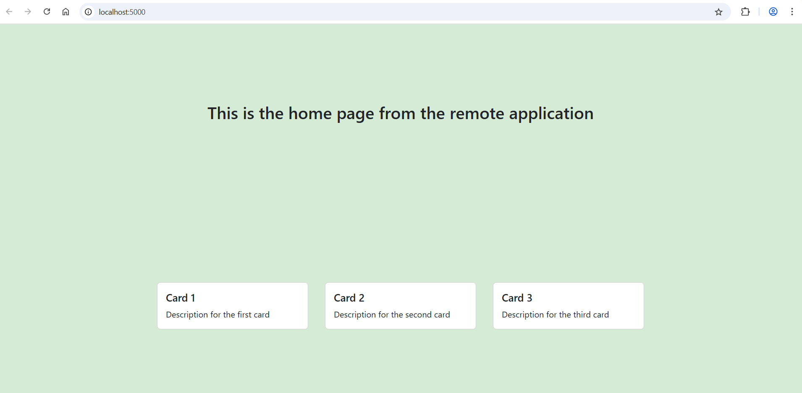
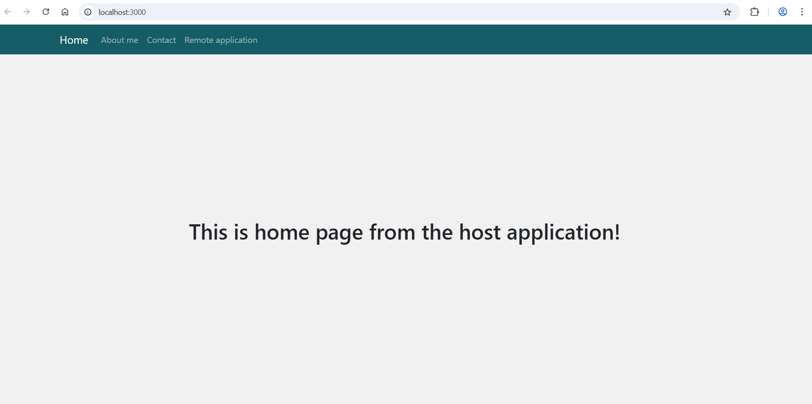
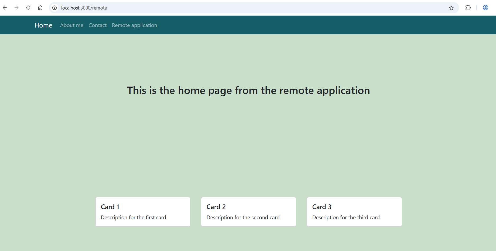

# Microfrontend with Webpack Module Federation

This is a simple **microfrontend project** using **Webpack Module Federation**.
The project consists of two applications:
- **Host App** - the main container application that loads remote modules
- **Remote App** - a standalone application exposed to be consumed by the host.

## Remote App
As a remote application we will use a simple React application built with Typescript and Webpack.



```
remote-app/
|--src/
|  |--pages/
|  |  |--Home.tsx
|  |--App.tsx
|  |--bootstrap.tsx
|  |--main.tsx
|--webpack.config.js
|--index.html
|--package.json
```
**bootstrap.tsx** - is used to start the app via dynamic import to ensure proper initialisation of shared modules with Webpack Module Federation.
**main.tsx** - serves as the main entry point for Webpack and dynamically imports bootstrap.tsx to initialize the app.
For the remote application we will use **port 5000**.

### Configure _Webpack Module Federation_ in the **webpack.config.js**:
```js
const ModuleFederationPlugin = require('webpack/lib/container/ModuleFederationPlugin');

      new ModuleFederationPlugin({

       name: "remote", // unique name used by host to reference the remote
        filename: "remoteEntry.js", // output file that host will load
        exposes: { 
          "./RemoteApp": "./src/App.tsx", // key-value map, key: how the host imports the module "RemoteApp"
          // value: path to the file being exposed "./src/App.tsx"
        },
        shared: { //shared dependencies, prevent loading multiple instances of shared library like React
          react: { singleton: true },
          'react-router-dom': {
            singleton: true,
          },
          'react-dom': {
            singleton: true,
          },
        },
      })
```
**remoteEntry.js** - is the entry file generated by Module Federation that exposes remote modules for dynamic loading by a host application

To run application use the following commands:
```
npm run build
npm run dev
```


## Host Application
As a host application we will use a simple React application built with Typescript and Webpack.



```
host-app/
|--src/
|  |--components/
|  |  |--Header.tsx
|  |--pages/
|  |  |--About.tsx
|  |  |--Contact.tsx
|  |  |--Home.tsx
|  |  |--Layout.tsx
|  |  |--NotFound.tsx
|  |  |--Task.tsx
|  |--App.tsx
|  |--bootstrap.tsx
|  |--main.tsx
|  |--custom.d.ts
|--webpack.config.js
|--index.html
|--package.json
```
**bootstrap.tsx** - is used to start the app via dynamic import to ensure proper initialisation of shared modules with Webpack Module Federation.
**main.tsx** - serves as the main entry point for Webpack and dynamically imports bootstrap.tsx to initialize the app.
For the host application we will use **port 3000**.

### Configure _Webpack Module Federation_ in the **webpack.config.js**:
```js
const ModuleFederationPlugin = require('webpack/lib/container/ModuleFederationPlugin');

            new ModuleFederationPlugin({
        name: 'host',// the unique name of the app in the federation
        remotes: {// it defines remote applications that the host can consume
          remote: "remote@http://localhost:5000/remoteEntry.js", // remoteAppName@url_to_remoteEntry.js
        },
        shared: { // it declares shared dependencies (like React) to avoid loading duplicates
          react: { singleton: true },
          'react-router-dom': {
            singleton: true,
          },
          'react-dom': {
            singleton: true,
          },
        },
      });
```
### Use the component from remote application in the host app
```tsx
const RemoteApp = lazy(() => import('remote/RemoteApp'));

const RemoteAppContainer = () => {
  return   <div style={{width: '100%'}}>
              <Suspense fallback={<div>Loading ...</div>}>
                <RemoteApp/>
              </Suspense>
          </div>
}
```
_Lazy import in React allows components to be loaded only when needed._

### custom.d.ts
To fix eslint warning we should declare modules for remote components in Module Federation:

```ts
declare module 'remote/RemoteApp';
```
### Set up a route for a remote component in the host application

```tsx
const routes: RouteObject[] = [
  {
    path: '/',
    element: <Layout/>,
    children: [
      {index: true, element: <Home/>},
      {path: 'about', element: <About/>},
      {path: 'contact', element: <Contact/>},
      {path: 'task', element: <Task/>},
      {path: 'remote/*', element: <RemoteAppContainer/>},
      {path: '*', element: <NotFound/>},
    ],
  },
];

export default routes;
```



To run application use the following commands:
```
npm run build
npm run dev
```
